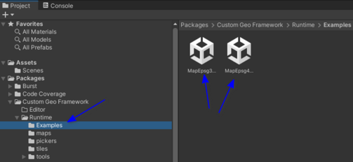
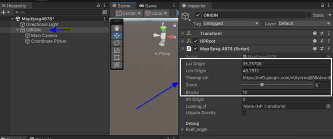
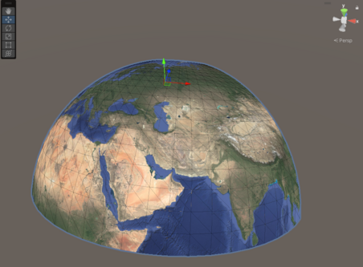
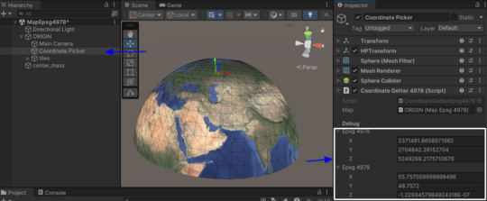

# Custom Geo

- [Usage](#usage)
- [Installation](#installation)
  - [1. Install High Precision Framework](#1-install-high-precision-framework)
  - [2. Install Custom Geo](#2-install-custom-geo)

## Usage
- Open the `Packages` folder and navigate to `Custom Geo Framework`
- Go to `Runtime/Examples`
- Select one of the existing scenes

- Select the `Origin` Gameobject in the Hierarchy view
- Adjust the map parameters: `Lat origin`, `Lon origin`, `Tilemap Url`, `Zoom`, `Blocks`

- Click on play button

- Select the `Coordinate Picker` in the Hierarchy view and move it around the scene

- The geographic and projected coordinates will update in real time

## Installation

### 1. Install High-Precision-Framework
- Go to `Window` > `Package Manager` to open the Package Manager window.
- Click the `+` button in the top left corner.
- Select `Add package from git URL...`.
- Add the following link `https://github.com/Unity-Technologies/com.unity.gis.high-precision-framework.git`

### 2. Install Custom Geo
- Once the High-Precision Framework is installed, repeat the process to add the Custom Geo library.
- Add the following link `https://github.com/xovobobo/UnityGeo.git`